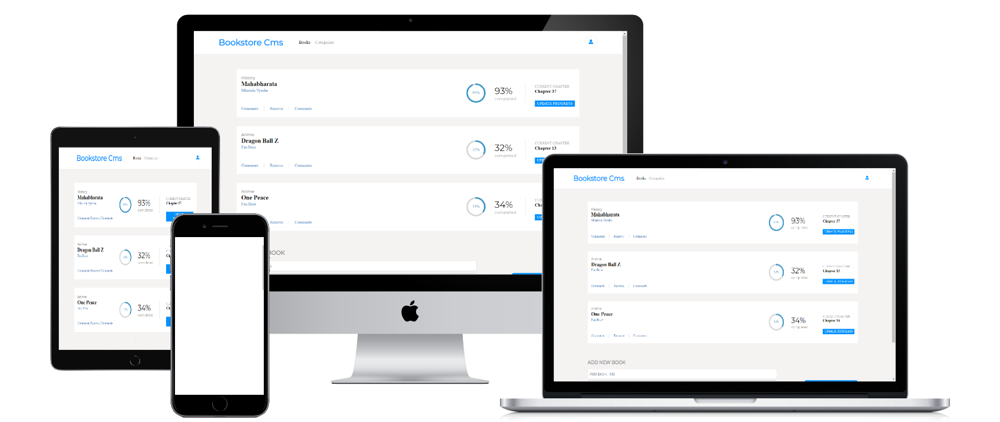

<a name="readme-top"></a>
<div align="center">
  

  <h1><b>Book Store</b><br><br></h1>
  
 </div>

<div align="center">
  <h1>App Mock</h1>
  
</div>
<br>

# 📗 Table of Contents

- [📖 About the Project](#about-project)
  - [🧪 Linters and Deployment](#linter)
  - [🛠 Built With](#built-with)
    - [Tech Stack](#tech-stack)
    - [Key Features](#key-features)
  - [🚀 Live Demo](#live-demo)
- [💻 Getting Started](#getting-started)
  - [Setup](#setup)
  - [Prerequisites](#prerequisites)
  - [Install](#install)
  - [Usage](#usage)
  - [Run tests](#run-tests)
  - [Deployment](#triangular_flag_on_post-deployment)
- [👥 Authors](#authors)
- [🔭 Future Features](#future-features)
- [🤝 Contributing](#contributing)
- [⭐️ Show your support](#support)
- [🙏 Acknowledgements](#acknowledgements)
- [❓ FAQ ](#faq)
- [📝 License](#license)

<!-- PROJECT DESCRIPTION -->

# 📖 Book Store <a name="about-project"></a>

This Project is for organizing your books and check the status of your reading  

**Book Store** is a React-oriented project and Api based Project, where you can add book to server and get books from the server 

## 🧪  Linters And Deployment <a name='linters'></a>
[](https://github.com/PowerLevel9000/book-store/actions/workflows/linters.yml)
[](https://app.netlify.com/sites/book-store-9000/deploys)
## 🛠 Built With <a name="built-with"></a>

### Tech Stack <a name="tech-stack"></a>

In this project I used many skills, tech and libraries

<details>
  <summary>Documentation</summary>
  <ul>
    <li><a href="https://html.com">HTML</a></li>
  </ul>
</details>

<details>
  <summary>Styling</summary>
  <ul>
    <li><a href="https://www.w3.org">CSS</a></li>
  </ul>
</details>

<details>
<summary>Dynamics And Logics</summary>
  <ul>
    <li><a href="https://www.javascript.com">JavaScript</a></li>
  </ul>
</details>
<details>
<summary>FrameWork</summary>
  <ul>
    <li><a href="https://reactjs.org/">React</a></li>
  </ul>
</details>


<br>

<!-- Features -->

### Key Features <a name="key-features"></a>

- **You can add your favorite books**
- **A home page**
- **An functionality to check the status**
- **An functionality to update status**


<p align="right">(<a href="#readme-top">back to top</a>)</p>

<!-- LIVE DEMO -->

## 🚀 Live Demo <a name="live-demo"></a>

This link will guide you to my project

- [Live Demo Link](https://lively-heliotrope-1d9830.netlify.app/)

<p align="right">(<a href="#readme-top">back to top</a>)</p>

<!-- GETTING STARTED -->

## 💻 Getting Started <a name="getting-started"></a>

For having local file and project you can fork this repo or clone it using `git clone https://github.com/PowerLevel9000/book-store.git`
And for making changes you you should follow prerequisites


### Prerequisites

In order to edit this project you need:

 - Any text editor such as note pad and word pad
 - A web browser
 - Node js installed
 - An IDE

#### Suggested IDE
 - Visual studio code `I prefer this one 🙃🙃`
 - Atom 
 - Sublime 
 - IntelliJ IDEA
 - Visual code 

### Setup

Clone this repository to your desired folder:

- Open your terminal there (bash cmd powershell run etc...) and run `npm i` to install node modules
- `npm start` this will open project in browser
- If you to edit something edit in src dir and then run in terminal `npm run build` to build it for production

- Before deployment have some linter check 
  - [ ] `npx stylelint "**/*.{css,scss}"` for css and saas file
  - [ ] `npx eslint .` for js files
  - [ ] `npx hint .` for html files 

- After fixing error build deploy for production

### Install 
```
npm i 
```
 ### Usage

 Execute the following thing:
 
 - books adding and removing
 - check status

### Deployment

You can deploy this project using:
- Fork our Repo and clone it or download `zip` and extract it
- Edit some changes
- Run `npm run build` to make our project production ready
- deploy it using [GitHub](www.github.com) pages (gh-pages run `npm i -D gh-pages` )
- also, you can use netlify to deploy it
 

<p align="right">(<a href="#readme-top">back to top</a>)</p>

<!-- AUTHORS -->

## 👥 Authors <a name="authors"></a>


👤 **Adarsh Pathak**

- GitHub: [@PowerLevel9000](https://github.com/githubhandle)
- Twitter: [@PowerLevel9002](https://twitter.com/PowerLevel9002?t=AIuSN7mTxk5a_MWpLolEjA&s=09)
- LinkedIn: [@Adarsh Pathak](https://www.linkedin.com/in/adarsh-pathak-56a831256/)


<!-- FUTURE FEATURES -->

## 🔭 Future Features <a name="future-features"></a>

- [ ] **mobile and tablet version**
- [ ] **improve functionality**
- [ ] **improve styling**
- [ ] **Some more pages**

<p align="right">(<a href="#readme-top">back to top</a>)</p>

<!-- CONTRIBUTING -->

## 🤝 Contributing <a name="contributing"></a>

Contributions, issues, and feature requests are welcome!

Feel free to check the [issues page](https://github.com/PowerLevel9000/book-store/issues).

<p align="right">(<a href="#readme-top">back to top</a>)</p>

<!-- SUPPORT -->

## ⭐️ Show your support <a name="support"></a>


If you like my Project give it a Star ✨🌟 

<p align="right">(<a href="#readme-top">back to top</a>)</p>

## ❓ FAQ <a name="faq"></a>

> ask questions to be here 

- **Question_1** How to add a book

  - Answer_1 submit the form to add a book

- **Question_2** How to remove a book  

  - Answer_2 Just Tap on the remove button and wait for a while 

<p align="right">(<a href="#readme-top">back to top</a>)</p>

<!-- LICENSE -->

## 📝 License <a name="license"></a>

This project is [MIT](https://github.com/PowerLevel9000/book-store/blob/dev/LICENSE) licensed.

<p align="right">(<a href="#readme-top">back to top</a>)</p>
